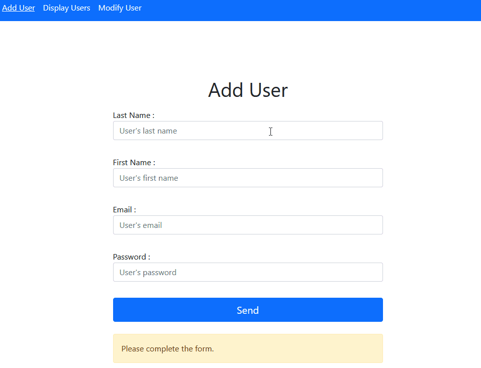

# PHPDB :elephant:

Database management project in [PHP](https://www.php.net/). SQL requests use [prepare()](https://www.php.net/manual/en/pdo.prepare.php) and [execute()](https://www.php.net/manual/en/pdostatement.execute.php) to secure the application by preventing [SQL injections attacks](https://developer.mozilla.org/en-US/docs/Glossary/SQL_Injection). The front end is done in [Boostrap](https://getbootstrap.com/) with a bit of custom CSS. The application registers users if they do not already exist, displays them and allows their modification. The forms send data in [POST](https://developer.mozilla.org/en-US/docs/Web/HTTP/Methods/POST) and report errors in [GET](https://developer.mozilla.org/en-US/docs/Web/HTTP/Methods/GET). For the exercise the passwords are hashed in [md5](https://www.php.net/manual/en/function.md5.php) but it is better to use something like [bcrypt](https://en.wikipedia.org/wiki/Bcrypt) in production.

